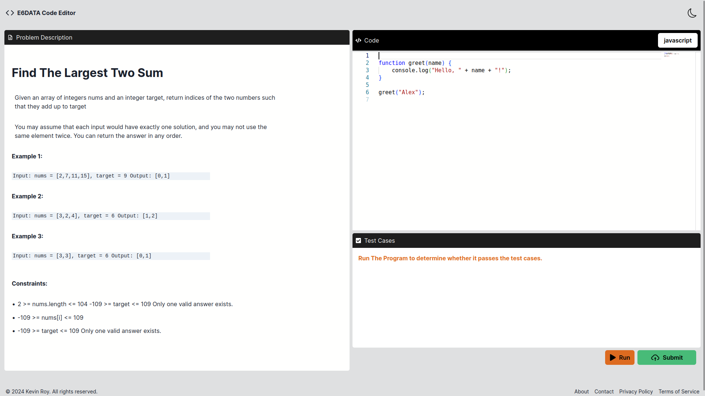
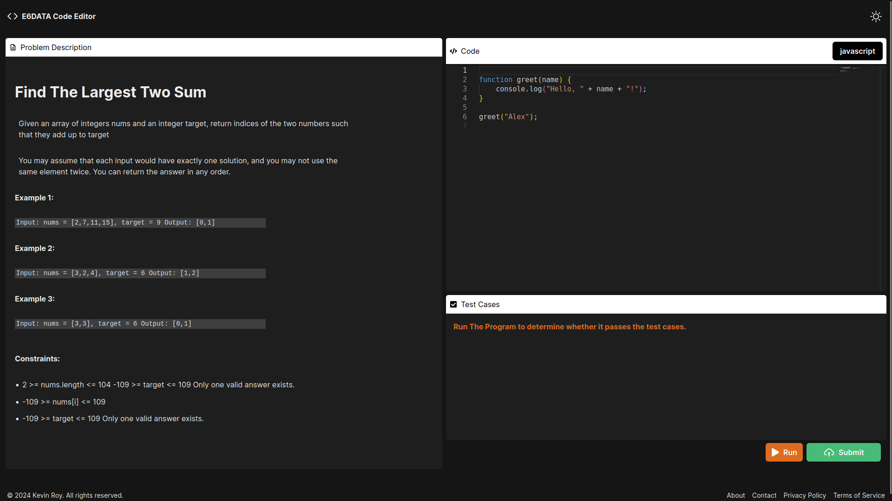

# CODE EDITOR UI

Project built using Next.Js + TypeScript and Chakra UI for styling.

Live Deployment link: [https://e6data-code-editor.vercel.app/](https://e6data-code-editor.vercel.app/)

---

## HOW TO RUN THE PROJECT

- clone the repository
- cd into the folder
- run 'yarn'
- after the installation, run 'yarn dev'
- the project should be runnning on your localhost:3000.

## folder structure

- the 'src' folder contains the whole source code
- 'src/components' contains the entire custom components that have been created.
- The 'src/app' is where the App resides, including the layout and the root file.

---

## Light Mode UI

## Dark Mode UI

If any clarifications, please contact [kevnroy1@gmail.com](mailto:kevnroy1@gmail.com)